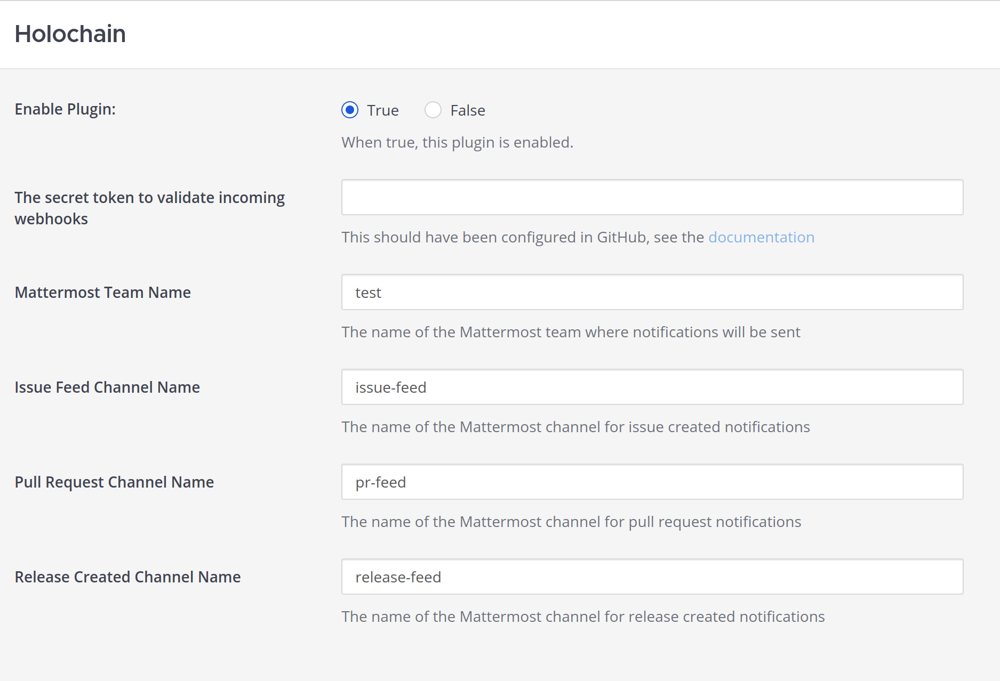

# Mattermost plugin

This repository has copied work from the [Mattermost plugin starter template](https://github.com/mattermost/mattermost-plugin-starter-template).
Please refer to that template for more instructions about using it!

## Set up a local MatterMost instance

You need a Mattermost instance to test with, either locally or remotely hosted. You can follow these [instructions](https://docs.mattermost.com/deployment-guide/server/containers/install-docker.html)
if you want to set up a local instance using Docker.

Choose the option without nginx, as you don't need TLS locally. That means starting with the command:

```shell
docker compose -f docker-compose.yml -f docker-compose.without-nginx.yml up -d
```

Update the configuration to allow uploading plugins:

```shell
docker compose cp mattermost:/mattermost/config/config.json .
```

Set the fields `PluginSettings.EnableUploads` to `true`, and `ServiceSettings.EnableLocalMode` to `true`.

Then copy the file back to the container:

```shell
docker compose cp config.json mattermost:/mattermost/config/config.json
```

Restart the container:

```shell
docker compose restart mattermost
```

Finally, create an admin user so you can get started.

```shell
 docker compose exec mattermost mmctl --local user create --email test@local.net --username test --password test1234 --system-admin
```

## Build the plugin

Check that your environment is ready to go by running

```shell
make all
```

Then deploy the plugin to your Mattermost instance:

```shell
export MM_SERVICESETTINGS_SITEURL="http://localhost:8065"
export MM_ADMIN_USERNAME="test"
export MM_ADMIN_PASSWORD="test1234"
make deploy
```

## Develop the plugin

Once you've deployed the plugin to Mattermost, it needs to be configured:



Note that you'll also need to create these channels before the plugin will be able to send messages to them. The plugin
will not create new channels.

Now, run the provided script to push test data:

```shell
./send_event.sh
```

You should see some posts. From there, you're ready to start making changes!
